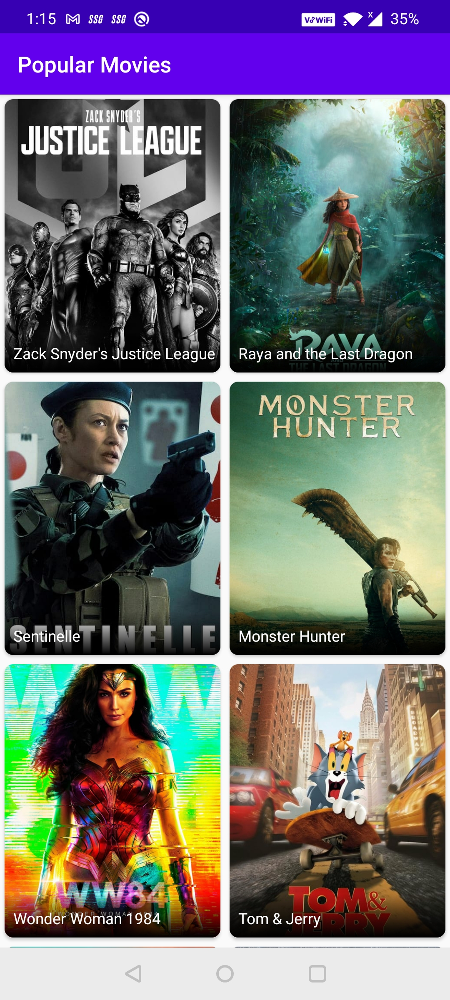
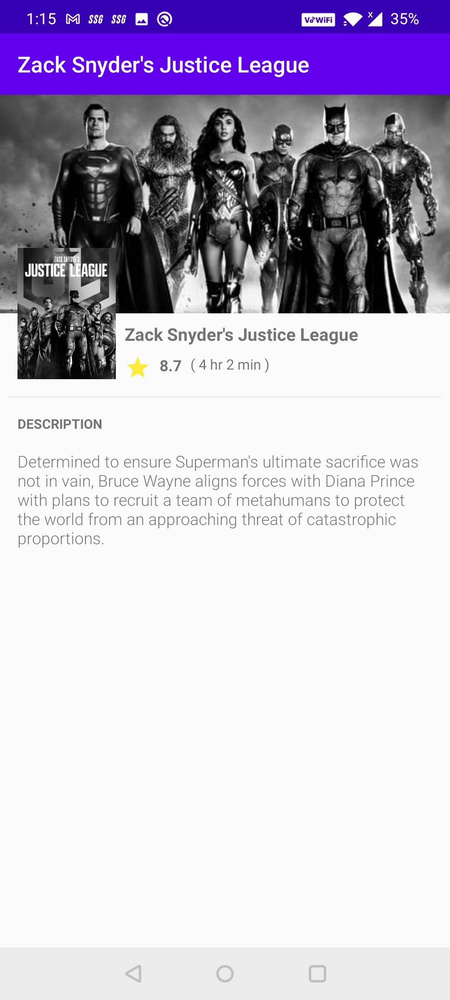

# MovieTest

# Preview
      

# Description
Here I have create a **Movie Detail** application. This application contains two page **Popular Movies** and **Movie Detail**. The first screen on the app is Popular Movies screen which fetch data from TMDB api and show popular movies. And when someone click on any of the movie it will show detail of that movie on the movie detail screen.

To build this application I have used **Kotlin** as programing language and following tech stacks.
### 1. MVVM Architecture
### 2. DataBinding
### 3. Navigation Component
### 4. Dagger2
### 5. Retrofit
### 6. Glide
### 7. Pagging 3.0
### 8. Coroutines
### 9. RoomDB
### 10. ViewModel
### 11. LiveData

